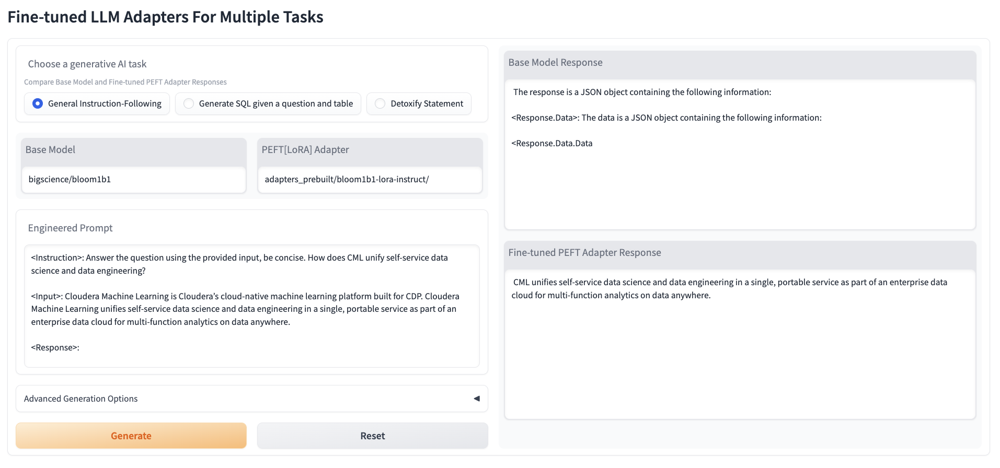
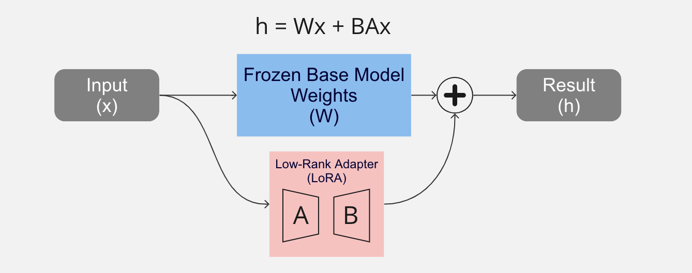
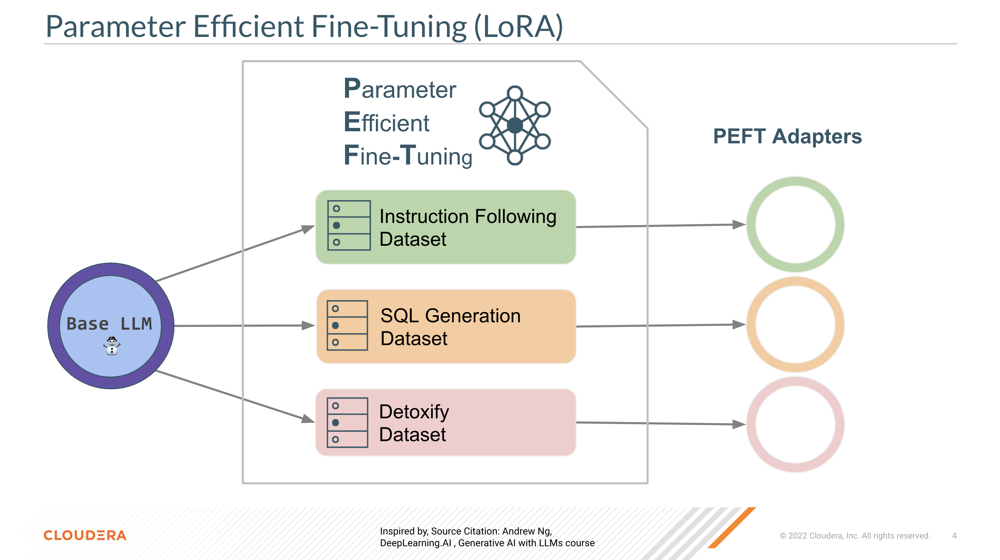
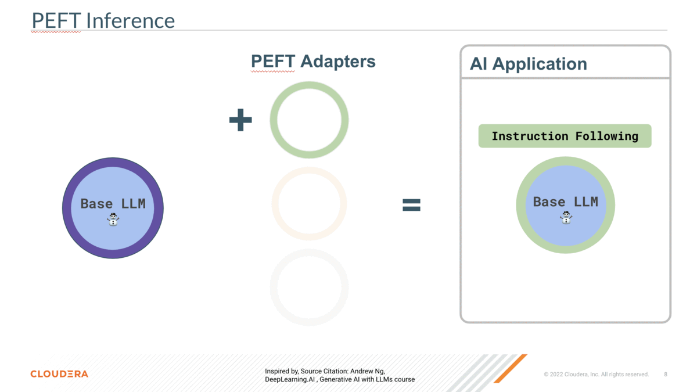

# Fine-Tuning a Foundation Model for Multiple Tasks (with QLoRA)

This repository demonstrates how to use [PEFT](https://huggingface.co/blog/peft) (Parameter-Efficient Fine-Tuning) and distribution techniques to fine-tune open source LLM (Large Language Model) for downstream language tasks.

## AMP Overview
In this AMP we show you how to implement LLM fine-tuning jobs that make use of the QLoRA and Accelerate implementations available in the PEFT open-source library from Huggingface and an example application that swaps the fine-tuned adapters in real time for inference targetting different tasks.

The fine-tuning examples for 3 different tasks are created as CML Jobs that can be run to reproduce the sample model adapters included in this AMP repo in [./amp_adapters_prebuilt](./amp_adapters_prebuilt).

## AMP Setup  
### Configurable Options
**NUM_GPU_WORKERS:** Configurable project environment variable set up for this AMP. This is the TOTAL number of distributed GPUs that the fine-tuning jobs will make use of during runtime. (Each individual fine-tuning worker will use a single GPU). If 1 is set, fine-tuning will happen on a single session only without distribution.
## AMP Concepts
### Fine-tuning optimization techniques
In this AMP we show how you can use cutting edge fine-tuning techniques to effictiently produce adapters finetuned for language tasks in CML.
- #### PEFT
  PEFT (Parameter-Efficient Fine-Tuning) are a class of fine-tuning techniques which allow for the effecient adaptation of LLMs to downstream tasks, training only a small amount of extra model parameters. 

  Full fine-tuning is effective and has been the default way to apply base LLMs to different tasks, but is now seen as  inefficient due to the ballooning size of LLMs and datasets. PEFT techniques promise time and cost efficiecnt fine-tuning pipelines and in the case of LoRA, adapters that can be remerged with the base model to create a new model or used as portable model adapters at runtime.

- ##### QLoRA
  One of the PEFT techniques officially supported in the huggingface library is QLoRA (Quantized Low Rank Adaptation). This fine-tuning technique is the result of two papers, the original [LoRA](https://arxiv.org/abs/2106.09685) and following [QLoRA](https://arxiv.org/abs/2305.14314).

  - LoRA fine-tuning freezes the original model parameters and trains a new small set of parameters with a dataset, at lower memory footprint and time therefore lower cost for still very effective learning. Furthermore, the adapter matrices are a fraction of the size of the base model weights and can be swapped out at inference time without changing the base model weights.
  *Inference with LoRA as described by the [LoRA paper](https://arxiv.org/abs/2106.09685). During fine-tuning time W is frozen while A and B contain the trainable parameters.*

  - QLoRA further increased efficiency, by using a new quantized data type and additional quanitization and memory optimization techniques to further drive the time and cost down.

  This allows us to use lower cost GPUs compared to full parameter fine-tuning, while still matching the performance of more intensive and costly full fine-tuning.

  All of the libraries required for configuring and launching QLoRA finetuning are available via from huggingface see [requirements.txt](./requirements.txt). Implementation examples from the huggingface can be founde [here](https://huggingface.co/blog/4bit-transformers-bitsandbytes)

- #### Distributed Training
  Using the PEFT and TRL open-source libraries from Huggingface means we also have easy access to [accelerate](https://github.com/huggingface/accelerate). Another Huggingface library which abstracts away the use of multiple GPUs and machines for fine-tuning jobs. As with many other kinds of distributed workloads, this cuts down on the time to fine-tune dramatically.

  As the name implies, distributed fine-tuning in accelerate means performing training operations on distributed setups. This could be multi-host with gpus on different hosts or multi-gpu with all gpus on the same host.

  Since TRL is integrated with accelerate already, it takes care of the data distribution and model duplication. See [this blog](https://huggingface.co/blog/pytorch-ddp-accelerate-transformers) for a breakdown of the abstraction layers huggingface have implemented that makes this convenient for us.

  CML is able to run accelerate distributed fine-tuning in multi-host mode out of the box using the [CML Workers API](https://docs.cloudera.com/machine-learning/cloud/distributed-computing/topics/ml-workers-api.html). Each CML Worker is launched in kubernetes and treated as a separate host with its own GPU, trl and accelerate do the rest!

### Sample Fine-tuned Tasks
For each the following fine-tuning tasks we start with the *smaller* LLM [bigscience/bloom-1b1](https://huggingface.co/bigscience/bloom-1b1).
This model was chosen for its tiny size and permissive license for commercial and research uses. The small size of this base model results in very short fine-tuning times and portable adapters that are simple to run for anyone looking to try this AMP (at the cost of poorer general performance.)

A larger base model or a base model from another LLM family could also be used with the same techniques shown in the scripts and sample notebook in this repository.
> An update to make this easier to do within this AMP is coming soon!

Each included sample adapter is fine-tuned on portions of publicly available datasets that have been mapped to fit desired inference patterns. While none of the included trained adapters are capable enough for production applications (* see [Improving on the Sample Adapters](#improving-on-the-sample-adapters)), each demonstrates clear task performance improvement over the base model with minimal training time by making use of the PEFT techniques described above.

The use of separate adapters means that in the Task Explorer application only a single copy of the Base Model is loaded, allowing for on-demand swapping of task fine-tuned adapters.

#### General Instruction Following
- Training Time/Cost: (8m19s / $0.82) distributed on 2x P3.2xlarge AWS instances
- Dataset: https://huggingface.co/datasets/teknium/GPTeacher-General-Instruct (mit)
  - Contains 89k examples of instruction-input-response text
#### SQL English to Query
- Training Time/Cost: (22m11s / $2.21) distributed on 2x P3.2xlarge AWS instances
- Dataset: https://huggingface.co/datasets/philschmid/sql-create-context-copy (cc-by-4.0)
  - Contains 80k examples of Question - Table - SQL text-to-sql strings
#### Detoxifying English Text
- Training Time/Cost: (8m50s / $0.86) distributed on 2x P3.2xlarge AWS instances
- Dataset: https://huggingface.co/datasets/s-nlp/paradetox (afl-3.0)
  - Contains 19k examples of toxic to neutral wording conversions in english

## Reproducing the prebuilt adapters
To see the training jobs running in CML firsthand, just start any of the fine-tuning jobs in the Jobs tab of your project. These will launch fine-tuning with accelerate distributed across multiple CML workers.

Adapters created via these jobs will appear in the Task Explorer Application after a restart and will be prefixed with a `Custom:` label. 
## Custom fine-tuned adapters
If you would like to attempt fine-tuning with a different data set or a different data mapping function for the prompt:
1. Adapt [Jupyter Notebook Example](#jupyter-notebook-example) for a simple fine-tuning script OR [Implementation Details](#implementation-details) for launching distributed fine-tuning with accelerate.
2. Ensure your fine-tuned adapter is placed in `amp_adapters_custom`
3. Restart the Task Explorer Application

> Note: The Task Explorer Application assumes the use of bloom1b1 as the base model, a future update will make it simpler to use a different base model for fine-tuning and inference.

## Task Explorer Application
The task explorer application in `4_app-task-explorer` loads up all the adapters found in `amp_adapters_prebuilt` and `amp_adapters_custom`. These are loaded on top of the base model for inference comparison.

Within the application environment, we make use of the novel benefit of LoRA adapters that allow for swapping of the fine-tuned adapter at runtime to make inference on multiple bespoke tasks seamless and all on a single GPU.

## Implementation Details
See detailed implementation descriptions in [distributed_peft_scripts/README.md](./distributed_peft_scripts/README.md)

## AMP Requirements

### CPU
- CML CPU workloads with resource profiles up to (2 vCPU / 18 GiB Memory) will be provisioned
### GPU
-  Minimum of nVidia V100 with 16GB vram is required (AWS p3.2xlarge)
- 1+ CML GPU workloads with resource profile (2 vCPU / 16 GiB Memory / 1 GPU) will be provisioned
  - Fine-tuning Examples (Optional)
    - A single gpu will run fine-tuning examples only in non-distributed mode
    - Multiple gpus will be required to run fine-tuning examples distributed across multiple CML sessions.
  - Application Inference
    - The task explorer application will require 1 GPU to perform inference
### CML Runtime
PBJ Workbench - Python 3.9 - Nvidia GPU - 2023.05
# Jupyter Notebook Examples
We have included notebook examples that demonstrate the code in the rest of the AMP project in a more digestible manner.

## QLoRA Fine-tuning example
A [notebook example](notebook_local_fine_tune_sample.ipynb) is provided to demonstrate what the fine-tuning techniques and libraries look like in a single script.
### Recommended Runtime
PBJ Workbench - Python 3.9 - Nvidia GPU - 2023.05
### Recommended Resource Profile
2 vCPU / 16 GiB Memory / 1 GPU

## QLoRA Fine-tuning example
A [notebook example](notebook_accelerate_distributed_fine_tune_sample..ipynb) is provided to demonstrate what accelerate distributed training (fine-tuning) looks like in CML using the CML Workers API.
### Recommended Runtime
JupyterLab - Python 3.9 - Nvidia GPU - 2023.05
### Recommended Resource Profile
2 vCPU / 16 GiB Memory / 1 GPU
+ 1 additional GPU for disctributed worker
